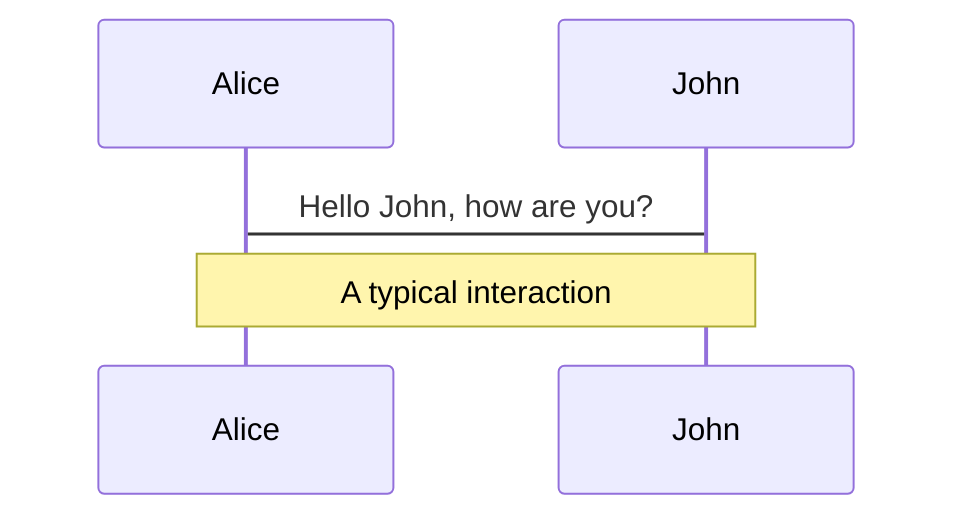
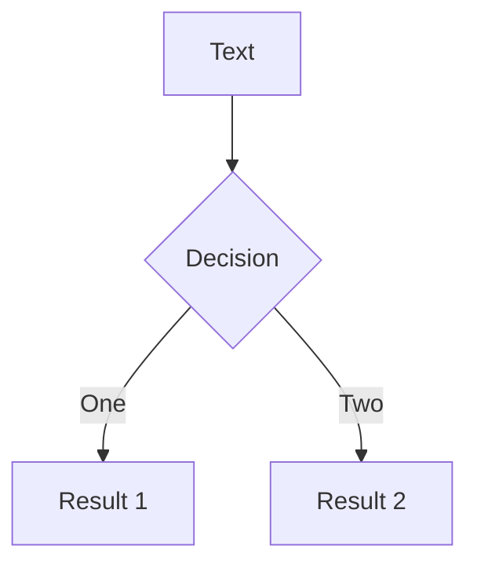
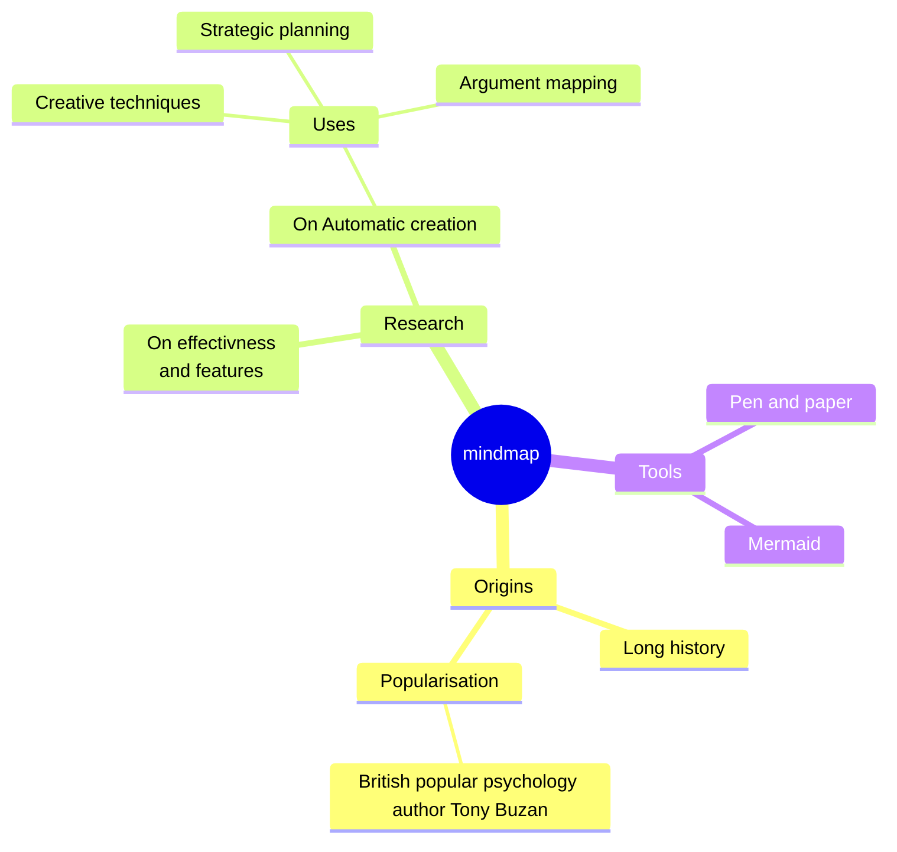
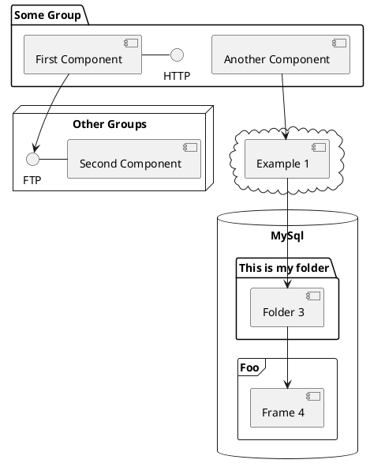

---
# try also 'default' to start simple
theme: academic
# some information about your slides, markdown enabled
title: "Dart Web: The Good, the Bad and the Wupper"
coverAuthor: Lucas Schuster
coverDate: ""
# https://sli.dev/custom/highlighters.html
highlighter: shiki
# https://sli.dev/guide/drawing
drawings:
  persist: false
# slide transition: https://sli.dev/guide/animations#slide-transitions
transition: slide-left
# enable MDC Syntax: https://sli.dev/guide/syntax#mdc-syntax
mdc: true
src: ./pages/00_cover.md
---

---
src: ./pages/01_history_recap.md
---

---
src: ./pages/03_how_does_dart_web_work.md
---

---
src: ./pages/04_how_do_i_create_a_dart_web_app.md
---

---
src: ./pages/05_dart_web_frameworks.md
---

---
src: ./pages/06_how_does_a_dart_web_framework_work.md
---

---
src: ./pages/07_build_cycle_explained.md
---

---
src: ./pages/08_demo_time.md
---

---
src: ./pages/09_outro.md
---

# Diagrams

You can create diagrams / graphs from textual descriptions, directly in your Markdown.

[Learn More](https://sli.dev/guide/syntax.html#diagrams)
